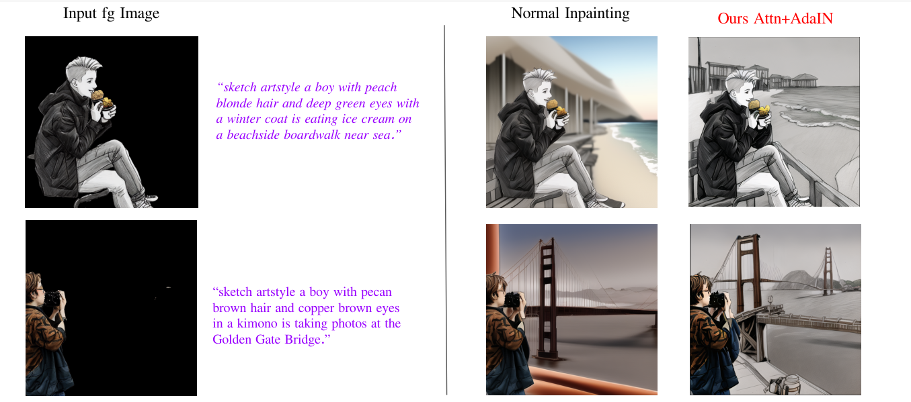

# Harmonious Background Generation Driven by Foreground Images

[Project Slide](https://docs.google.com/presentation/d/1CAWBnfH-Yx8kBsKU2P_xrVJmqkB3Ze7m/edit?usp=sharing&ouid=112605403951022205460&rtpof=true&sd=true)  


### Dependencies
- Pytorch=2.0.1
- Diffusers (lastest)
- accelerate

Run the following code to create the conda env.
```
conda create --name pfn_creative python=3.9
pip install -r requirements.txt
```

### Dataset and Pretrained Model Download

#### Dataset Download
- [Dataset 10 kinds of data (10000 images totally) ~11.4G](https://drive.google.com/file/d/1X3JuGEmbBLQ1DSow3I0BjvlMLsGMSRqc/view?usp=drive_link)


#### Pretrained Models: 
- [Stable Diffusion Base Model](https://drive.google.com/drive/folders/18VwbbSgXstljCZjSPtxRQk_d_u1Rap8B?usp=drive_link)
- [Stable Diffusion Specific VAEs](https://drive.google.com/drive/folders/1GQAPNkIPwRQfHmbFZSqUxZE-xmUeZ1rD?usp=sharing)
- [Anime Segmentation Model](https://huggingface.co/skytnt/anime-seg) 
- [Pretrained Converters](https://drive.google.com/drive/folders/1TYNrCkQCWuR2wZunYG9kfw7XwSnhwSLL?usp=sharing)


### Training the Converters

Before training, initialize the `accelerate` environment
```
accelerate config default
```

- Train Start with Pure Black Background

```
cd scripts
sh train_sd_f2b.sh
```
Set the training options  in the scirpts into `"TRAIN_SD15_Inpainting_F2B_Mix_with_Attn_And_AdaIN_Simple"` . 

- Train Start with Initial Inpainting Background
```
cd scripts
sh train_sd_f2b.sh
```
Set the training options  in the scirpts into `"TRAIN_SD15_Inpainting_F2B_Mix_with_Attn_And_AdaIN_Start_With_Inpaint"` . 


### Inference the Background using Converters

```
cd scripts
sh  inference.sh
```

set the infernece options to change the models.


### Evaluate the Results with LPIPS and FID
```
cd scripts

sh evaluation.sh
```